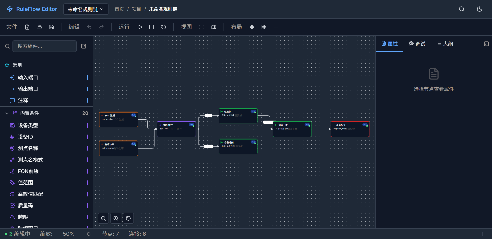

# RuleFlow Editor

基于 [LogicFlow](https://site.logic-flow.cn/) 的可视化规则链编辑器，面向工业物联网（IIoT）和电力自动化(SCADA)场景，提供拖拽式规则编排、实时调试与可视化执行能力。



## 功能特性

- **可视化规则编排** — 拖拽式画布，支持从侧栏拖入 50+ 内置/扩展/VPP 专用节点
- **多类型节点体系** — 输入端口、条件节点、动作节点、扩展节点、流程控制、注释节点
- **关系类型着色** — True/False/Success/Failure/自定义 五种关系连线，自动颜色编码
- **属性面板** — 选中节点查看基础配置、组件配置、连接关系
- **调试模式** — 模拟执行规则链，单步/暂停/继续，实时节点状态追踪
- **命令面板** — `Ctrl+K` 快速搜索命令
- **节点搜索** — `Ctrl+F` 模糊搜索画布中的节点
- **自动布局** — 拓扑排序一键整理画布布局
- **小地图 & 大纲** — 画布缩略导航 + 节点大纲列表
- **明暗主题** — 浅色/深色/跟随系统三种主题模式
- **密度调节** — 舒适/紧凑/超紧凑三档布局密度
- **国际化** — 中文 / English 双语支持

## 技术栈

| 类别       | 技术                                                                                                                                          |
| ---------- | --------------------------------------------------------------------------------------------------------------------------------------------- |
| 框架       | [Preact](https://preactjs.com/) + [htm](https://github.com/developit/htm)                                                                     |
| 状态管理   | [@preact/signals](https://preactjs.com/guide/v10/signals)                                                                                     |
| 流程图引擎 | [@logicflow/core](https://www.npmjs.com/package/@logicflow/core) + [@logicflow/extension](https://www.npmjs.com/package/@logicflow/extension) |
| 样式       | CSS Modules + CSS 自定义属性（Design Token 体系）                                                                                             |
| 构建工具   | [Vite 8](https://vitejs.dev/)                                                                                                                 |
| 图标       | [lucide-preact](https://lucide.dev/)                                                                                                          |
| 模糊搜索   | [Fuse.js](https://www.fusejs.io/)                                                                                                             |
| 国际化     | 自写轻量 i18n（key-value 方案）                                                                                                               |
| 弹窗通知   | [react-hot-toast](https://react-hot-toast.com/)                                                                                               |

## 项目结构

```
ruleflow-edit/
├── public/
│   ├── favicon.svg            # 编辑器图标
│   └── icons.svg              # 图标精灵图
├── src/
│   ├── main.jsx               # 入口：初始化主题 & 挂载
│   ├── app.jsx                # 根组件
│   ├── index.css              # 全局样式
│   ├── components/
│   │   ├── navbar/            # 顶部导航栏（品牌、规则链选择、搜索、主题、通知）
│   │   ├── toolbar/           # 工具栏（文件、编辑、运行、视图、布局操作）
│   │   ├── sidebar/           # 左侧面板（节点分类、搜索、拖拽）
│   │   ├── canvas/            # 画布区域（LogicFlow 实例、缩放、关系选择器、属性气泡）
│   │   ├── panel/             # 右侧面板（属性、调试、大纲）
│   │   ├── nodes/             # 自定义节点模型 & 渲染（BaseNode、RelationEdges）
│   │   └── statusbar/         # 底部状态栏（画布状态、缩放、节点/边计数、保存状态）
│   ├── data/
│   │   └── nodeRegistry.js    # 节点注册表（分类、类型映射、关系定义）
│   ├── i18n/
│   │   └── index.js           # 国际化配置（zh/en）
│   ├── layout/
│   │   └── RuleFlowEditor.jsx # 编辑器主布局（CSS Grid 四行三列）
│   ├── store/
│   │   └── editorStore.js     # 全局状态（Signals：主题、布局、画布、调试、选择）
│   └── theme/
│       ├── tokens.css          # Design Token 系统（颜色、间距、排版、阴影）
│       └── ThemeToggle.jsx     # 主题切换组件
├── index.html                  # HTML 入口
├── vite.config.js              # Vite 配置（Preact + Tailwind + React 兼容别名）
└── package.json
```

## 安装步骤

### 环境要求

- **Node.js** >= 18.0
- **npm** >= 9.0

### 克隆项目

```bash
git clone <repository-url>
cd ruleflow-edit
```

### 安装依赖

```bash
npm install
```

### 启动开发服务器

```bash
npm run dev
```

开发服务器默认在 `http://localhost:5173` 启动，支持热模块替换（HMR）。

### 构建生产版本

```bash
npm run build
```

构建产物输出到 `dist/` 目录。

### 预览生产构建

```bash
npm run preview
```

## 使用示例

### 创建规则链

1. 启动编辑器后，画布默认加载一条示例规则链（SOC 监控 → 值变换 → 调度下发）
2. 点击工具栏 **文件 → 新建** 清空画布，从空白开始编排

### 添加节点

- **从侧栏拖拽**：在左侧面板找到目标节点，按住鼠标拖入画布
- 侧栏支持模糊搜索，输入关键词快速定位节点
- 节点按分类折叠显示：内置条件、内置动作、扩展节点、VPP 专用、流程控制

### 连接节点

- 鼠标悬停节点锚点，拖出连线至目标节点
- 创建连线后自动弹出 **关系类型选择器**，选择 True / False / Success / Failure / 自定义
- 连线颜色自动匹配关系类型：True=绿色、False=红色、Success=蓝色、Failure=琥珀色

### 编辑属性

- 单击节点，右侧面板显示属性信息
- 可查看节点名称、优先级、启用状态、连接关系
- 面板支持三种模式：固定 / 浮动 / 内联

### 调试执行

1. 点击工具栏 **运行 → 启动** 或右侧面板 **调试** 标签页中的运行按钮
2. 编辑器进入调试模式，按节点类型拓扑排序逐步执行
3. 每个节点依次标记为"处理中"→"成功/失败"
4. 支持暂停、继续、单步执行
5. 执行日志实时记录到调试面板

### 快捷键

| 快捷键   | 功能                          |
| -------- | ----------------------------- |
| `Ctrl+K` | 打开命令面板                  |
| `Ctrl+F` | 搜索画布节点                  |
| `Ctrl+.` | 切换布局密度                  |
| `Ctrl+Z` | 撤销（由 LogicFlow 内置支持） |
| `Ctrl+S` | 保存规则链                    |
| `Ctrl+B` | 切换侧栏                      |
| `Ctrl+J` | 切换面板                      |
| `F5`     | 运行调试                      |
| `F11`    | 专注模式                      |

### 自动布局

工具栏 **布局 → 自动布局** 基于 BFS 拓扑排序算法自动排列所有节点：
- 入度为 0 的节点排最左
- 按有向边方向逐层向右扩展
- 同层节点纵向排列

## 节点体系

项目内置 50+ 节点类型，按后端架构对齐分为 5 大类别：

| 类别     | 数量 | 说明                             | 对应后端路径                     |
| -------- | ---- | -------------------------------- | -------------------------------- |
| 内置条件 | 19   | 无状态 + 有状态条件判断          | `pkg/ruleflow/builtin/condition` |
| 内置动作 | 11   | 值变换、重命名、路由、告警等     | `pkg/ruleflow/builtin/action`    |
| 扩展节点 | 16   | 表达式过滤、历史比较、策略执行等 | `pkg/ruleflow/ext`               |
| VPP 专用 | 16   | SOC 监控、调度控制、碳排放计算等 | `pkg/ruleflow/extensions`        |
| 流程控制 | 2    | 子规则链、消息生成器             | `pkg/ruleflow/extensions/flow`   |

此外还有始终可用的端口节点和注释节点。

## 设计体系

编辑器采用 **VPPTU 视觉设计规范 v2.0**，基于 Design Token 体系构建：

- **颜色**：语义化 Token（`--rf-brand-primary`、`--rf-status-success` 等），明暗主题自动切换
- **间距**：4px 基准网格（`--rf-space-1` ~ `--rf-space-10`）
- **排版**：Inter + Noto Sans SC + JetBrains Mono 字体栈
- **圆角**：统一 Token（`--rf-radius-sm` ~ `--rf-radius-xl`）
- **阴影**：三级阴影系统（`--rf-shadow-sm` ~ `--rf-shadow-lg`）
- **无障碍**：颜色 + 图标双重编码（色盲安全），ARIA 标注

## 关联项目

- **[ruleflow](../ruleflow)** — Go 语言后端引擎，提供规则链执行引擎和 API
- **[LogicFlow](../LogicFlow)** — 滴滴开源的流程图编辑框架（本项目基于 v2.2）

## 贡献指南

欢迎贡献代码！请遵循以下流程：

### 开发流程

1. **Fork & Clone** — Fork 本仓库到你的账号，然后 Clone 到本地
2. **创建分支** — 从 `main` 创建功能分支：
   ```bash
   git checkout -b feature/your-feature-name
   ```
3. **安装依赖 & 开发**：
   ```bash
   npm install
   npm run dev
   ```
4. **提交代码** — 遵循 [Conventional Commits](https://www.conventionalcommits.org/) 规范：
   ```
   feat: add xxx node type
   fix: resolve edge drag offset issue
   docs: update README
   refactor: extract shared logic from BaseNode
   ```
5. **构建验证** — 确保构建无错误：
   ```bash
   npm run build
   ```
6. **提交 Pull Request** — 描述变更内容和关联 Issue

### 代码规范

- **组件结构**：每个组件一个文件，导出命名函数组件
- **样式**：使用 Design Token（CSS 自定义属性），避免硬编码颜色和数值
- **状态管理**：全局状态使用 `@preact/signals`，组件局部状态使用 `useState`
- **国际化**：用户可见文本必须通过 `t()` 函数，并在 `src/i18n/index.js` 添加翻译条目
- **节点注册**：新增节点类型需同时更新 `nodeRegistry.js`（`NODE_CATEGORIES` + `NODE_VISUAL_MAP`）和 `BaseNode.js`（颜色/图标映射）
- **无障碍**：交互元素添加 `aria-label`、`role` 属性

### 新增节点类型

1. 在 `src/data/nodeRegistry.js` 的 `NODE_CATEGORIES` 对应分类中添加条目
2. 在 `NODE_VISUAL_MAP` 中添加类型到视觉分类的映射
3. 在 `src/components/sidebar/Sidebar.jsx` 中导入并注册 Lucide 图标
4. 如果需要新的视觉样式，在 `src/components/nodes/BaseNode.js` 中添加颜色和图标映射

### 报告问题

- 提交 Issue 时请描述复现步骤、预期行为和实际行为
- 附上浏览器版本和操作系统信息
- 如果可能，提供截图或录屏

## 许可证

Private — 仅供授权使用
